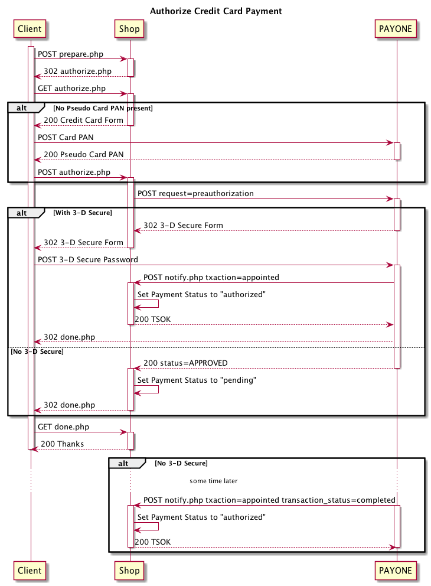
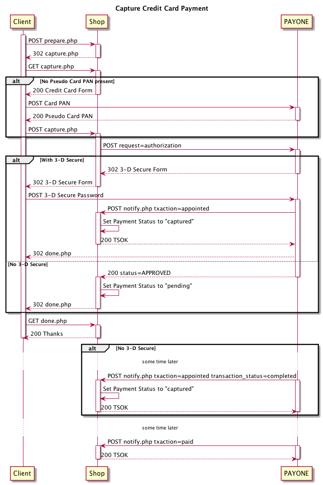

# Credit Card

* [Authorize](#authorize)
* [Capture](#capture)
* [Capture Authorized Payment](#capture-authorized-payment)
* [Refund](#refund)

# Authorize

```php?start_inline=1
use Payum\Core\Request\Authorize;
use Valiton\Payum\Payone\Api;

$payment = [
    Api::FIELD_PAYMENT_METHOD => Api::PAYMENT_METHOD_CREDIT_CARD_PPAN,
    Api::FIELD_LANGUAGE => 'de',
];

$payum
    ->getGateway('payone')
    ->execute(new Authorize($payment));
```



# Capture

```php?start_inline=1
use Payum\Core\Request\Capture;
use Valiton\Payum\Payone\Api;

$payment = [
    Api::FIELD_PAYMENT_METHOD => Api::PAYMENT_METHOD_CREDIT_CARD_PPAN,
    Api::FIELD_LANGUAGE => 'de',
];

$payum
    ->getGateway('payone')
    ->execute(new Capture($payment));
```



## Capture Authorized Payment

See [Paydirekt Capture Authorized Payment](paydirekt.md#capture-authorized-payment)

## Refund

See [Paydirekt Refund](paydirekt.md#refund)

