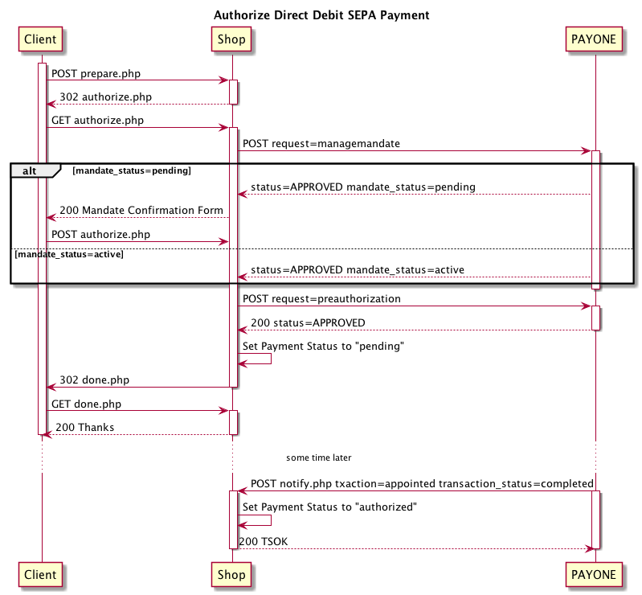
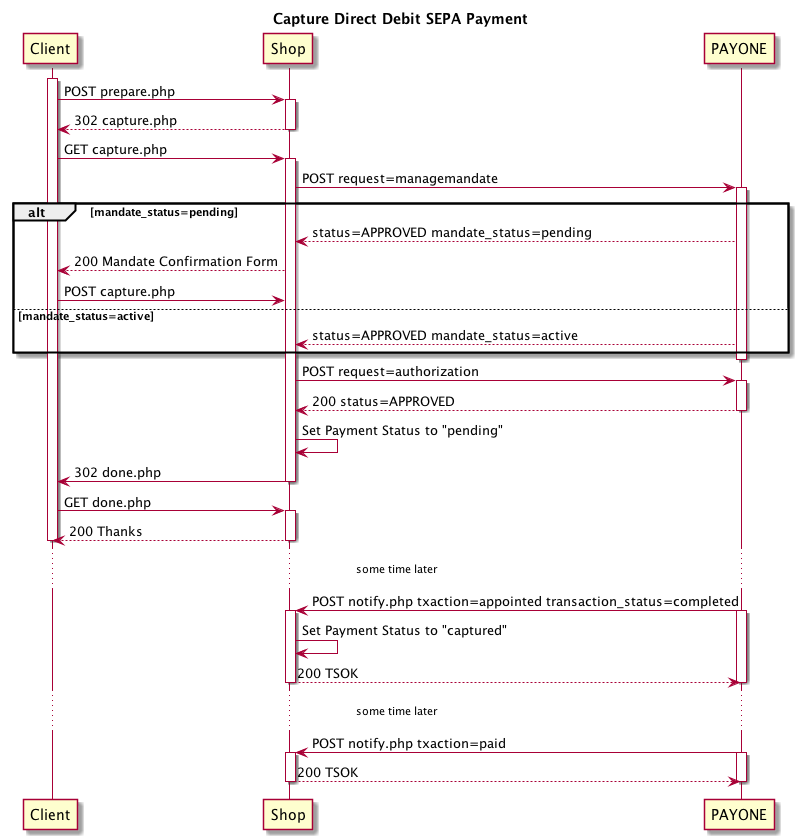

# Direct Debit SEPA

* [Authorize](#authorize)
* [Capture](#capture)
* [Capture Authorized Payment](#capture-authorized-payment)
* [Refund](#refund)
* [Managing Mandates](#managing-mandates)

## Authorize

`Authorize` is done via the `preauthorize` API call.

```php
use Payum\Core\Request\Authorize;
use Valiton\Payum\Payone\Api;

$payment = [];
$payment[Api::FIELD_PAYMENT_METHOD] = Api::PAYMENT_METHOD_DIRECT_DEBIT_SEPA;

$payum
    ->getGateway('payone')
    ->execute(new Authorize($payment));
```



## Capture

`Capture` is done via the `authorize` API call. Don't get confused.

```php
use Payum\Core\Request\Capture;
use Valiton\Payum\Payone\Api;

$payment = [];
$payment[Api::FIELD_PAYMENT_METHOD] = Api::PAYMENT_METHOD_DIRECT_DEBIT_SEPA;

$payum
    ->getGateway('payone')
    ->execute(new Capture($payment));
```



## Capture Authorized Payment

See [Paydirekt Capture Authorized Payment](paydirekt.md#capture-authorized-payment)

## Refund

See [Paydirekt Refund](paydirekt.md#refund)

## Managing Mandates

To perform a direct debit payment with SEPA you need a SEPA mandate. This mandate has to be retrieved *prior* to the
Authorization Request. Usually this is handled implicitly.

```php
use Payum\Core\Security\SensitiveValue;
use Valiton\Payum\Payone\Api;
use Valiton\Payum\Payone\Request\Api\GetSepaMandate;

$payum
    ->getGateway('payone')
    ->execute($mandate = new GetSepaMandate([
        Api::FIELD_CITY => 'Berlin',
        Api::FIELD_COUNTRY => 'DE',
        Api::FIELD_CURRENCY => 'EUR,
        Api::FIELD_IBAN => SensitiveValue::ensureSensitive('DE19123412341234123412'),
        Api::FIELD_LAST_NAME => $form->get('lastname')->getData(),
    ]));

if ($mandate->isApproved()) {
    // do something with the mandate
    $mandate->getMandateIdentification();
    
    // text for the customer
    $mandate->getMandateText();
}
```

The mandate has to be confirmed with an `Api\PreAuthorize` or a `Api\Authorize` within two hours.

You can also download the Mandate PDF file

```php
use Valiton\Payum\Payone\Api;
use Valiton\Payum\Payone\Request\Api\GetSepaMandatePdf;

$payum
    ->getGateway('payone')
    ->execute($mandatePdf = new GetSepaMandatePdf([
        Api::FIELD_FILE_REFERENCE => 'XX-T0000000',
    ]));

echo $mandatePdf->getFileContents();
```
