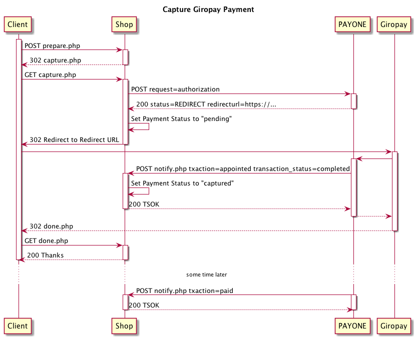

# Giropay

The IBAN is the only required parameter.

If you pass a BIC parameter it will be used by Payone. Even if it is empty!

Giropay with Bank Code and Bank Account Number is not supported anymore.

## Authorize

```php?start_inline=1
use Payum\Core\Request\Authorize;
use Valiton\Payum\Payone\Api;

$payment = [];
$payment[Api::FIELD_PAYMENT_METHOD] = Api::PAYMENT_METHOD_GIROPAY;

$payment[Api::FIELD_IBAN] = 'DE46940594210000012345';

$payum
    ->getGateway('payone')
    ->execute(new Authorize($payment));
```



## Capture

```php?start_inline=1
use Payum\Core\Request\Capture;
use Valiton\Payum\Payone\Api;

$payment = [];
$payment[Api::FIELD_PAYMENT_METHOD] = Api::PAYMENT_METHOD_GIROPAY;

$payment[Api::FIELD_IBAN] = 'DE46940594210000012345';

$payum
    ->getGateway('payone')
    ->execute(new Capture($payment));
```
