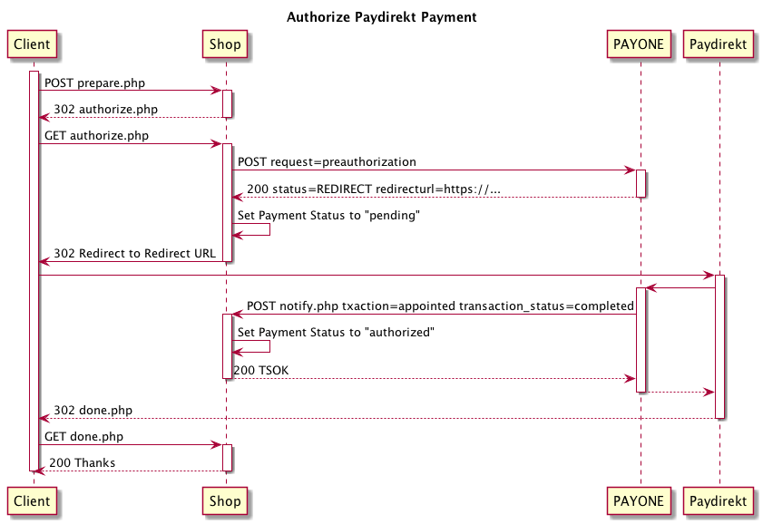
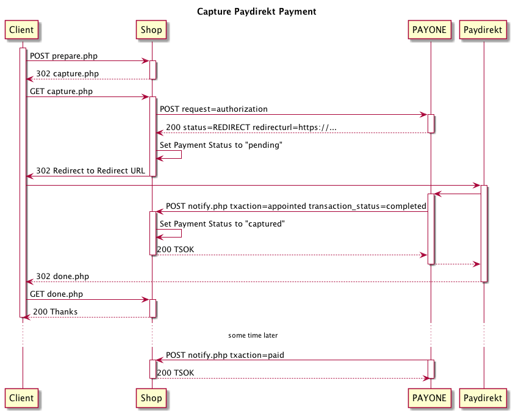
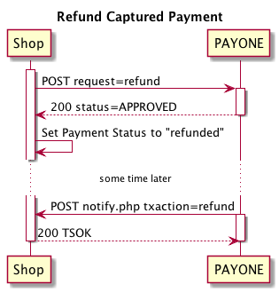

# Paydirekt

* [Authorize](#authorize)
* [Capture](#capture)
* [Capture Authorized Payment](#capture-authorized-payment)
* [Refund](#refund)

## Authorize

```php?start_inline=1
use Payum\Core\Request\Authorize;
use Valiton\Payum\Payone\Api;

$payment = [];
$payment[Api::FIELD_PAYMENT_METHOD] = Api::PAYMENT_METHOD_PAYDIREKT;

$payum
    ->getGateway('payone')
    ->execute(new Authorize($payment));
```



## Capture

```php?start_inline=1
use Payum\Core\Request\Capture;
use Valiton\Payum\Payone\Api;

$payment = [];
$payment[Api::FIELD_PAYMENT_METHOD] = Api::PAYMENT_METHOD_PAYDIREKT;

$payum
    ->getGateway('payone')
    ->execute(new Capture($payment));
```



## Capture Authorized Payment

```php?start_inline=1
use Payum\Core\Model\Payment;
use Payum\Core\Request\Capture;

$payments = $payum
    ->getStorage(Payment::class)
    ->findBy(['number' => $paymentNumber]);
$payment = array_shift($payments);

$token = $payum->getTokenFactory()->createCaptureToken(
    'payone',
    $payment,
    'done.php'
);

header('Location: ' . $this->redirect($token->getTargetUrl());
```


## Refund

Only captured payments can be refunded.

```php?start_inline=1
use Payum\Core\Model\Payment;
use Payum\Core\Request\Refund;

$payments = $payum
    ->getStorage(Payment::class)
    ->findBy(['number' => $paymentNumber]);
$payment = array_shift($payments);

$payum
    ->getGateway('payone')
    ->execute(new Refund($payment));
```



